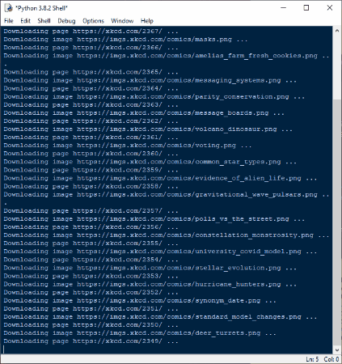

# xkcdDownload
My own take on the project from Al Sweigart's book "Automate the Boring Stuff".

Downloads all comics from the xkcd website, saves the files by comic number, and prints an error log in the shell. 

Written in Python.

Check out the next repository, chgWinWallpaper, which includes a script I wrote that uses these saved images and displays a different xkcd comic each day as my Windows desktop background!

## :memo: Usage

Decide where you want the images saved and change the path accordingly. Then run the script.

The error log will print in the shell. There are 7 files that could not be saved, as they are interactive comics. Therefore, your error log will most likely resemble this:

SKIPPED page https://xkcd.com/2198/
SKIPPED Invalid URL https://xkcd.com/2067/
SKIPPED page https://xkcd.com/1663/
SKIPPED page https://xkcd.com/1608/
SKIPPED Invalid URL https://xkcd.com/1525/
SKIPPED page https://xkcd.com/1416/
SKIPPED page https://xkcd.com/1350/

## :snake: Dependencies

Written in Python for Windows. This script uses the following Python modules: os, bs4, requests, and the requests exception InvalidURL.